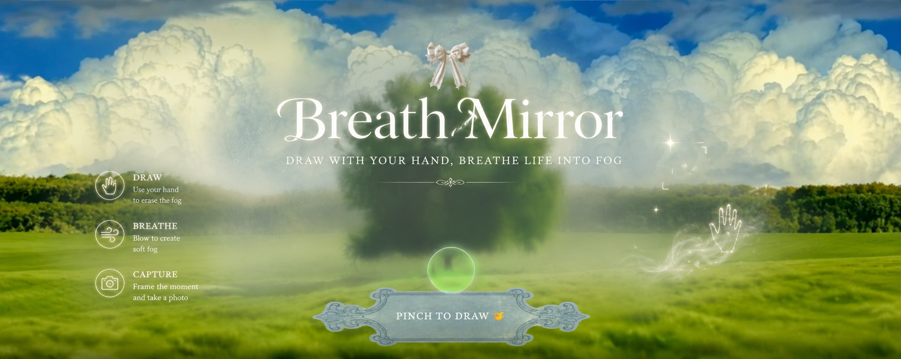

<p align="center">
  
</p>
An immersive real-time web experience that transforms your camera feed into an interactive “living mirror”.
You can **draw in the air using your hand**, reveal fog with your breath, and capture cinematic snapshots like an art installation.

 -What this project does
Detects your hand using AI (MediaPipe Hands)
Lets you **draw in the air using gestures**
Uses your **breath (microphone input)** to generate fog effects
Captures artistic snapshots of your interaction
Includes animated curtains opening like a gallery installation reveal
Runs fully in the browser (no backend)


-Customization freedom
You are free to modify and improve the experience:
* Change UI layout, typography, and visual style
* Replace or redesign **curtains**
* Modify buttons, icons, and interface elements
* Add new interaction modes (brushes, effects, gestures)
* Improve animation and visual atmosphere

-Assets rules
To keep visuals clean and professional:
* All images must be **PNG format**
* All images must have **transparent backgrounds**
* Avoid JPG or images with visible background boxes
* Recommended structure:
```
assets/
 ├── cursor.png
 ├── Undo.png
 ├── Clear.png
 ├── left-curtain.png
 ├── right-curtain.png
 ├── status.png
```

-How to run this project
Follow these steps carefully:
1. **Download the project ZIP file**
2. **Unzip** it on your computer
3. Open **Visual Studio Code**
4. Click:

   ```
   File → Open Folder
   ```

   and select the extracted project folder
5. Open the file:

   ```
   blow.html
   ```
6. Right-click inside the file
7. Select:

   ```
   Open with Live Server
   ```

-Important permissions
When the project starts:
*Allow Camera access
*Allow Microphone access
Without these permissions, the experience will not work.

-Tech used
*HTML / CSS / JavaScript
*WebRTC (camera + microphone)
*Web Audio API (breath detection)
*MediaPipe Hands (gesture tracking)
*Canvas API (visual rendering system)

📌 Notes
**Works best on Google Chrome
**Use a laptop or PC with webcam
**Run using Live Server (required for camera access)


